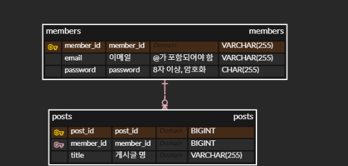

### 지원자
전우재

## 애플리케이션 실행 방법
- 개발 환경
  - Spring Boot 2.7.14
  - MySQL 8.0.22 (blog라는 이름의 스키마 필요)
  - JDK 11
- 실행 방법
```shell
$ ./gradlew bootjar
$ java -jar build/libs/wanted-pre-onboarding-backend-0.0.1-SNAPSHOT.jar
```
- Docker-Compose
```shell
$ ./gradlew bootjar
$ docker-compose up -d
```
### 모든 API 실행 영상
https://youtu.be/bIYpxubMGrE

## API 명세서
### 1. 사용자 회원가입
- 요구사항
  - 이메일과 비밀번호로 회원가입할 수 있는 엔드포인트를 구현해 주세요.
  - 이메일과 비밀번호에 대한 유효성 검사를 구현해 주세요.
  - **이메일 조건: @ 포함**
  - **비밀번호 조건: 8자 이상**
  - 비밀번호는 반드시 **암호화**하여 저장해 주세요.
  - 이메일과 비밀번호의 유효성 검사는 위의 조건만으로 진행해 주세요. **추가적인 유효성 검사 조건은 포함하지 마세요**.
- ### Request
  - POST /members
```json
{
    "email":"dnwo0719@naver.com",
    "password":"12345678" 
}
```
- ### Response
  - 201 CREATED
  - 400 가입 양식에 맞지 않은 경우
  ```json
    "message": " Invalid Input Value",
    "status": 400,
    "errors": [
        {
            "field": "email",
            "value": "",
            "reason": "password must not be blank"
        }
    ],
    "code": "C001"
  ```
- #### 실행 화면

- #### 구현 방법 및 이유
  - 로그인을 시도한 사용자 한명을 찾기 위해 email을 unique key로 결정했습니다.
    - 사용자가 로그인 하기 위해 email과 비밀번호를 입력하기 때문에 email로 사용자 정보를 가져오려면 email이 고유성을 가져야 해 unique key로 선언했습니다.
    - 하지만 중복 회원 가입 방지는 요구조건에 포함되어 있지 않아 중복 가입이면 성공한 응답을 주도록 하였습니다.
  - 데이터 저장은 객체처럼 다룰 수 있는 JPA를 사용하여 수행했습니다.

### 2. 사용자 로그인
- 요구사항
  - 사용자가 올바른 이메일과 비밀번호를 제공하면, 사용자 인증을 거친 후에 **JWT(JSON Web Token)**를 생성하여 사용자에게 반환하도록 해주세요.
  - 회원가입 엔드포인트에 **이메일과 비밀번호의 유효성 검사**기능을 구현해주세요.
- ### Request
  - POST /login
```json
{
    "email":"dnwo0719@naver.com",
    "password":"12345678"
}
```
- ### Response
  - 200 OK
  ```json
  header "Authorization" : "{AccessToken}"
  ```
  - 403 해당 사용자 없음
  - 500 양식에 맞지않음
- #### 실행 화면

- #### 구현 방법 및 이유
  - security의 로그인을 사용하기 위해 UsernamePasswordAuthenticationFilter를 커스텀화했습니다.
  - attemptAuthentication에서 로그인 시도를 처리합니다.
    - LoginRequestdto를 만들며 유효성 검사를 진행합니다.
      - Validator를 사용하여 형식과 크기를 지정했습니다.
    - 로그인이 통과되면 UsernamePasswordAuthenticationToken를 생성하여 AuthenticationManager에 전달되고 실제 인증이 진행됩니다.
  - successfulAuthentication에서 로그인 이후 작업을 진행합니다.
    - authResult를 통해 인증한 사용자 정보를 가져옵니다.
    - 해당 사용자 이메일을 token화 하여 헤더로 반환합니다.
  - 회원가입과 로그인은 토큰을 검사하지 않도록 보안설정했습니다.
  - JWT 기반으로 사용자 권한을 확인하기 때문에 STATELESS 옵션으로 설정했습니다.

### 3. 게시글 생성
- ### Request
  - POST /posts
  - header "Authorization" : "Bearer {AccessToken}"
```json
{
    "title":"취업하는 방법"
}
```
- ### Response
  - 200 OK
  - 400 내용이 없을 경우, 양식에 맞지 않은 경우
  - 500 토큰이 없는 경우
- #### 실행 화면

- #### 구현 방법 및 이유
  - 사용자와 게시글을 1:N 관계로 저장할 수 있도록 JPA를 사용했습니다.
  - 요구사항이 자세히 없어 간단하게 제목만 저장하였습니다.

### 4. 게시글 목록 조회
- 요구사항
  - 반드시 **Pagination** 기능을 구현해 주세요.
- ### Request
  - GET /posts?page=0&size=3&sort=id,desc
  - header "Authorization" : "Bearer {AccessToken}"

- ### Response
  - 200 OK
  - 500 토큰이 없는 경우
```json
[
  {
    "postId": 3,
    "title": "취업하는 방법"
  },
  {
    "postId": 2,
    "title": "오늘의 운동"
  },
  {
    "postId": 1,
    "title": "개발 방법론"
  }
]
```
- #### 실행 화면


- #### 구현 방법 및 이유
  - Pagination을 구현하기 위해 Page객체를 사용했습니다.
    - 해당 객체를 바로 JpaRepository에서 반환 가능하여 생산성이 좋습니다.
    - 조회할 페이지, 한번에 표시할 갯수, 정렬 기준과 방법을 정하여 조회할 수 있습니다.

### 5. 특정 게시글 조회
- 요구사항
  - **게시글의 ID를 받아** 해당 게시글을 조회하는 엔드포인트를 구현해 주세요.
- ### Request
  - GET /posts/{게시글_ID}
  - header "Authorization" : "Bearer {AccessToken}"
- ### Response
  - 200 OK
```json
{
  "postId": 3,
  "title": "취업하는 방법"
}
```
  - 400 게시글이 없는 경우
  - 500 토큰이 없는 경우
- #### 실행 화면
  
- #### 구현 방법 및 이유
  - 통상적인 RestAPI 조건에 따라 주소에서 ID를 받아 해당 ID의 게시글을 조회하도록 했습니다.

### 6. 특정 게시글 수정
- 요구사항
  - **게시글의 ID와 수정 내용을 받아** 해당 게시글을 수정하는 엔드포인트를 구현해 주세요.
  - 게시글을 수정할 수 있는 사용자는 **게시글 작성자만**이어야 합니다.
- ### Request
  - PUT /posts/{게시글_ID}
  - header "Authorization" : "Bearer {AccessToken}" (소유자 확인)
```json
{
    "title":"취업하는 방법"
}
```
- ### Response
  - 200 OK
  - 400 게시글이 없는 경우
  - 403 권한이 없는 경우
  - 500 토큰이 없는 경우
- #### 실행 화면

- #### 구현 방법 및 이유
  - 통상적인 RestAPI 조건에 따라 주소에서 ID를 받고 수정할 내용은 body로 받으며 행위는 method로 인식했습니다.
  - 수정할 수 있는 권한을 가지고 있는지 Jwt로 확인합니다.
    - JWT에서 Claim을 파싱해 이메일을 얻습니다.
    - 해당 email의 Member 객체가 post에 권한이 있는지 확인합니다.

### 7. 특정 게시글 삭제
- 요구사항
  - **게시글의 ID를 받아** 해당 게시글을 삭제하는 엔드포인트를 구현해 주세요.
    게시글을 삭제할 수 있는 사용자는 **게시글 작성자만**이어야 합니다.
- ### Request
  - DELETE /posts/{게시글_ID}
  - header "Authorization" : "Bearer {AccessToken}" (소유자 확인)

- ### Response
  - 200 OK
  - 400 게시글이 없는 경우
  - 403 권한이 없는 경우
  - 500 토큰이 없는 경우
- #### 실행 화면

- #### 구현 방법 및 이유
  - 통상적인 RestAPI 조건에 따라 주소에서 ID를 받고 수정할 내용은 body로 받으며 행위는 method로 인식했습니다.
  - 수정할 수 있는 권한을 가지고 있는지 Jwt로 확인합니다.
    - JWT에서 Claim을 파싱해 이메일을 얻습니다.
    - 해당 email의 Member 객체가 post에 권한이 있는지 확인합니다.


## 가산점 요소
- **통합 테스트** 또는 단위 테스트 코드를 추가한 경우
- docker compose를 이용하여 애플리케이션 환경을 구성한 경우 (README.md 파일에 docker-compose 실행 방법 반드시 기입)
- 클라우드 환경(AWS, GCP)에 배포 환경을 설계하고 애플리케이션을 배포한 경우 (README.md 파일에 배포된 API 주소와 설계한 AWS 환경 그림으로 첨부)

## 아키텍처
- 시스템 아키텍처 (배포 IP: 13.124.78.2:8080)
  

- ERD
  
